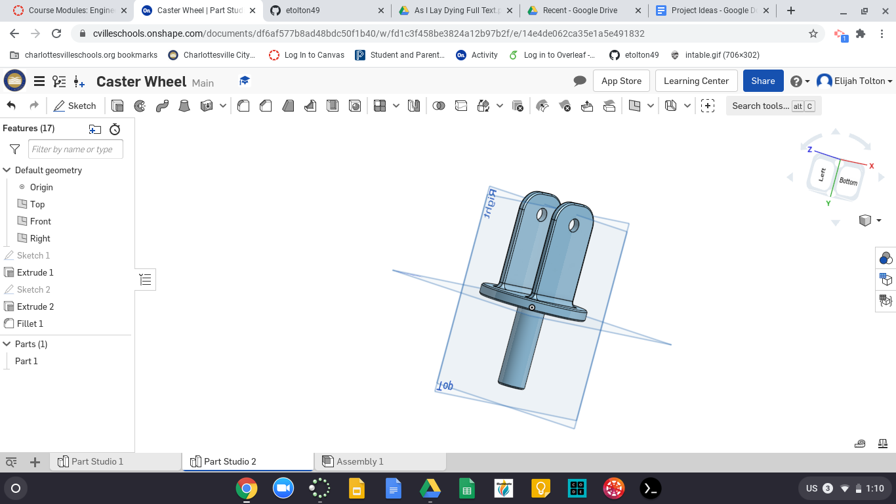
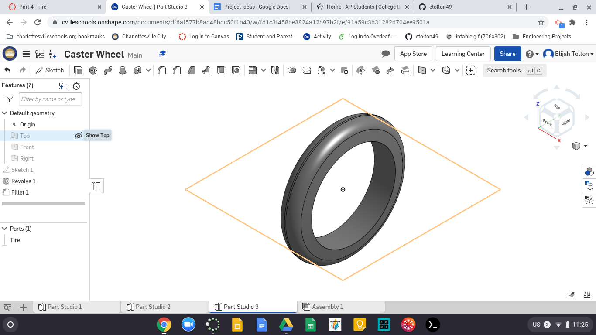
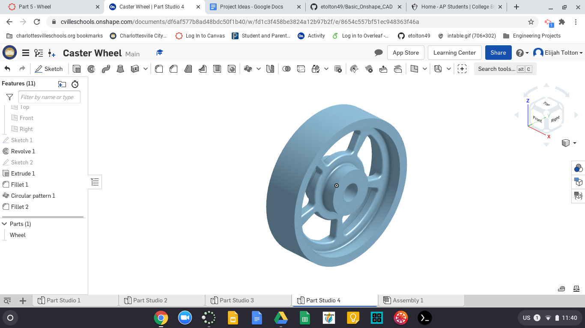
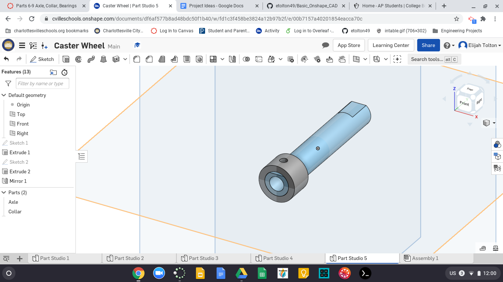
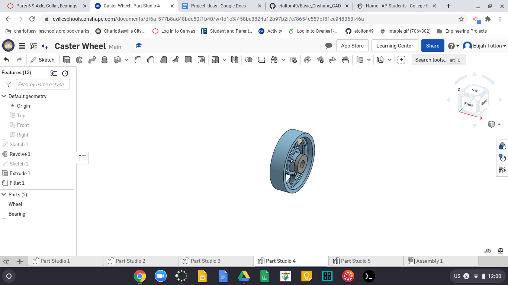
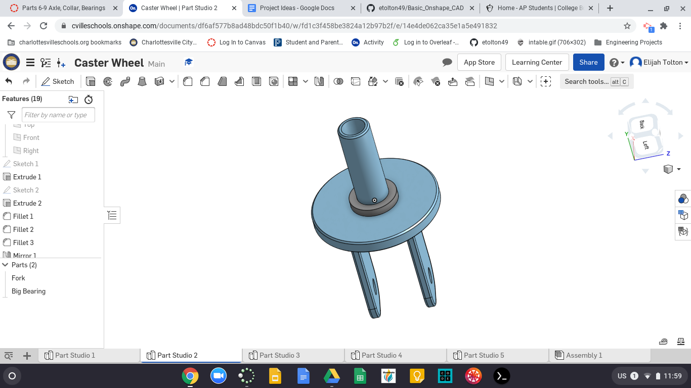
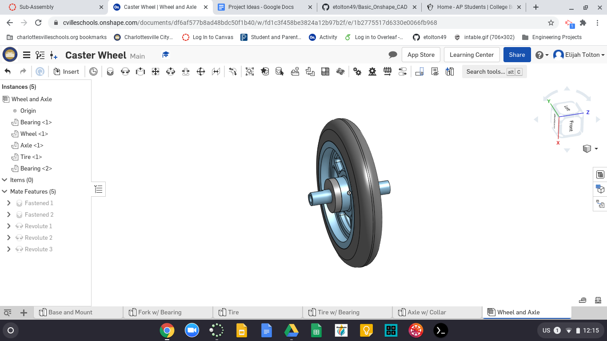

# Basic_Onshape_CAD
## Part 1

I just finished making the base plate for part 1. It was fairly simple and took barely a minute. I did struggle with the feature pattern for a minute though. I clicked the wrong edge and couldn't figure out why it was only patterning 4 hole instead of 6. In the end I have just clicked the wrong edge for the direction of the pattern and it was a simple fix.

## Part 2

I made my second part, the mount, in the same parts studio as my base. This made it very easy as all I had to do was draw the sqaure and all the holes I had made on the base were continued into the mount. The only issue with this is that if I wanted to change the holes just on one I could run into an issue; however, these holes are intended for screws so it really shouldn't matter because they should always be on top of each other.

## Part 3

I chose to make this part in a separate studio because it did not reference any of the previous parts. It was failry straight forward and I didn't really struggle with it. The tangent fillets definitely were helpful and nice because you only have to select one edge.

## Part 4

This is my tire for the caster. It was my first time using revolve in Onshape and it went smoothly. I'm starting to get used to using some of the shortcuts which are definitely nice.

## Part 5

Here is my wheel. Everything went smoothly on this part. I didn't think it would be beneficial to keep it in the same part studio as the tire so I made a separate one. 

## Part 6 and 7

This is my axle and collar made in one part studio. Pretty simple.

## Part 8

This bearing was very simple. Just two cicles referencing the center of the wheel.

## Part 9

This piece was also very easy. I decided to made it in the same studio as my fork as I know that it is refencing that part.

## Wheel Subassembly

Here is my first attempt at an assembly in Onshape. It went well the only thing I struggled with was selecting the right mate connector.
