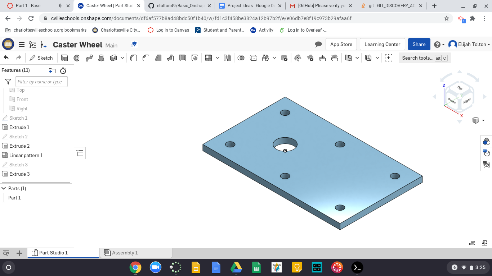
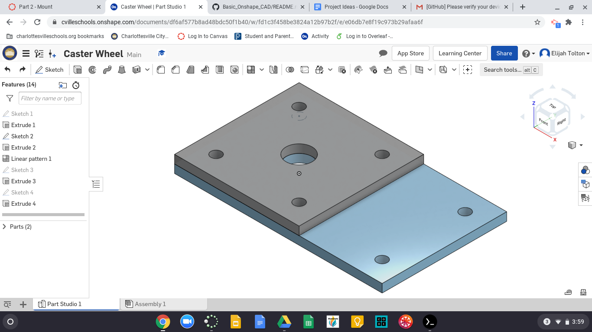

# Basic_Onshape_CAD
## Part 1

I just finished making the base plate for part 1. It was fairly simple and took barely a minute. I did struggle with the feature pattern for a minute though. I clicked the wrong edge and couldn't figure out why it was only patterning 4 hole instead of 6. In the end I have just clicked the wrong edge for the direction of the pattern and it was a simple fix.

## Part 2

I made my second part, the mount, in the same parts studio as my base. This made it very easy as all I had to do was draw the sqaure and all the holes I had made on the base were continued into the mount. The only issue with this is that if I wanted to change the holes just on one I could run into an issue; however, these holes are intended for screws so it really shouldn't matter because they should always be on top of each other.
